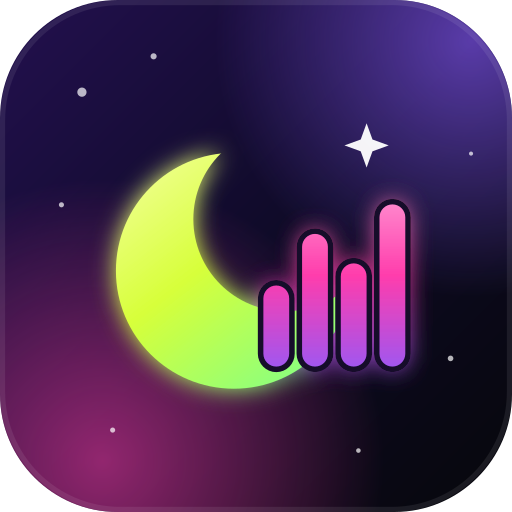

# ORIVEXY NIGHTS

**Qué pasa esta noche en las discotecas de Barcelona.**

&nbsp;

&nbsp;

Descárgala, ábrela y listo. Gratis.

 

  

&nbsp;

&nbsp;

## Qué tiene

- 🗺️ **Mapa de Barcelona** con todas las discotecas, en 3D y en vista satélite.
- 🎉 **Fiestas de discoteca** de cada día, con foto, hora, lugar y precio.
- 🎟️ **Comprar entradas** en un clic, cuando el evento las vende.
- 🕐 **Horarios** de cada discoteca: abierto ahora o a qué hora abre.
- 📸 **Comunidad**: fotos y vídeos de la noche, sigue a gente y a locales.
- 🔄 **Siempre al día**: la información se actualiza sola cada día.

## Cómo abrirla la primera vez

- **Windows**: abre el archivo descargado. Si sale un aviso azul, pulsa *Más información* → *Ejecutar de todas formas*.
- **Mac**: abre el archivo, arrastra ORIVEXY NIGHTS a *Aplicaciones*. La primera vez: clic derecho sobre la app → *Abrir*.
- **Linux**: clic derecho sobre el archivo → *Propiedades* → *Permitir ejecutar*, y doble clic.
- **Móvil**: con la app abierta en el ordenador, menú *ORIVEXY NIGHTS* → *Abrir en el móvil* y escanea el código.

Datos oficiales abiertos del Ayuntamiento de Barcelona y de la Generalitat de Catalunya, © colaboradores de OpenStreetMap y ortofoto del ICGC.

